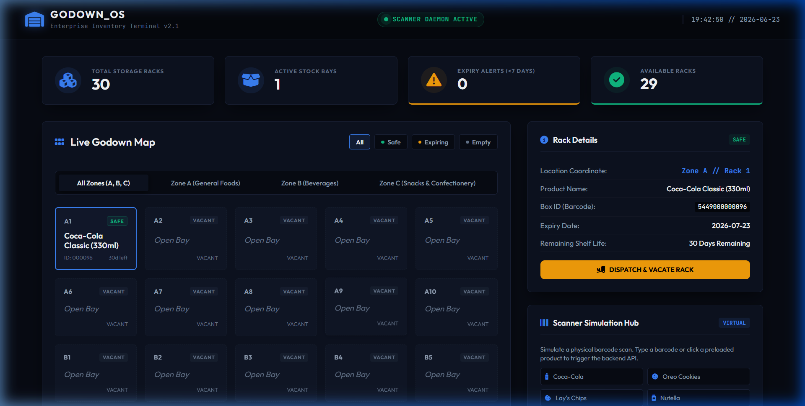
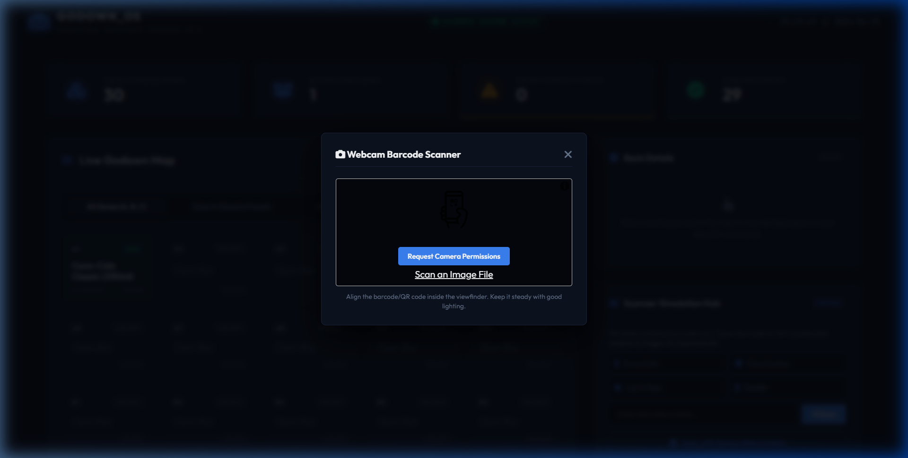

# Smart Godown Inventory OS

A production-ready smart godown inventory dashboard combining a physical USB Barcode Scanner (HID keyboard emulator) and a device web camera scanner.

## Key Features & Architecture

1. **Database Schema (`warehouse.db`)**:
   - Pre-populated with 30 slots across Zones A, B, and C (10 racks per zone) for general inventory.
2. **Flask Backend (`app.py`)**:
   - Exposes REST APIs for inventory polling (`/api/inventory`), item dispatching (`/api/dispatch`), and simulation scans (`/api/sim_scan`).
   - Automatically computes rack safety status based on expiration dates.
3. **Dual Barcode Scanner System**:
   - **Physical USB Barcode Scanner (HID emulation)**: A global keyboard hook daemon running via `pynput` in a background thread. Captures keystrokes, aggregates them, and uses a **120ms threshold filter** to separate high-speed scanner input from manual human typing to avoid system interference.
   - **Device Web Camera Barcode Scanner**: An integrated HTML5 webcam scanner powered by `html5-qrcode` inside a premium modal drawer. Decodes barcodes/QRs using your device camera and transmits the product to the backend dynamically.
4. **Enterprise UI Dashboard**:
   - Polling engine that fetches inventory states and log streams every 2 seconds.
   - Interactive 3D/glassmorphism CSS Grid map displaying zones and racks.
   - Live KPI status counters and action details drawer for dispatching stock.
   - Interactive Virtual Scanner Simulator for easy testing.

---

## Verification Results

### 1. Initial State & Scanning Simulation
The dashboard loads with all 30 racks vacant. Clicking the "Coca-Cola" scan simulator button instantly triggers the database assignment. 
- Barcode `5449000000096` resolves to **Coca-Cola Classic (330ml)**.
- Slot **A1** updates in real-time to `Safe` (Teal border/background) with remaining shelf-life.
- KPIs update automatically: Active Stock Bays becomes **1**, Available Racks becomes **29**.




### 2. Device Web Camera Barcode Scanner Modal
Clicking **"Scan with Device Web Camera"** in the Scanner Simulation Hub opens a sleek, glassmorphic modal box to capture barcodes from the user's camera feed:



### 3. Dispatching Items
Selecting any filled rack opens the details drawer:
- Shows location, product details, barcode, and remaining days.
- Clicking **DISPATCH & VACATE RACK** clears the slot, returning it to vacant status and logging the transaction in the console events window.

---

## Getting Started

### Prerequisites
- Python 3.8+
- SQLite3

### Installation
1. Clone the repository:
   ```bash
   git clone https://github.com/SreeHarshaMS/smart_pantry.git
   cd smart_pantry
   ```
2. Create a virtual environment and install requirements:
   ```bash
   python -m venv .venv
   source .venv/bin/activate  # On Windows: .venv\Scripts\activate
   pip install -r requirements.txt
   ```
3. Initialize the database:
   ```bash
   python database.py
   ```
4. Run the Flask application:
   ```bash
   python app.py
   ```
5. Open your browser and navigate to `http://127.0.0.1:5000/`.
